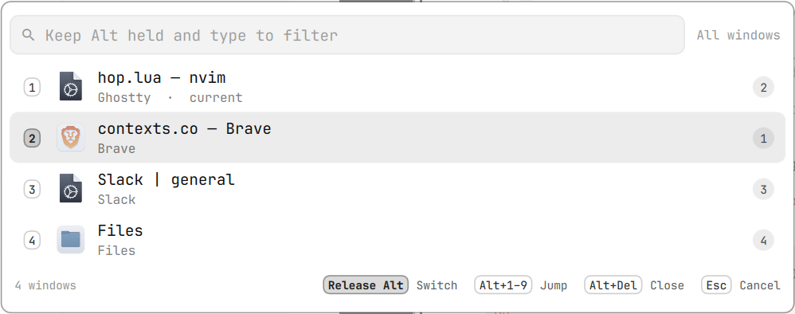

<div align="center">

# Jumpy

**Alt+Tab for the Omarchy shell, built for speed.**
Tap to flip back, hold to see every window, type to find one.

`de.gransoftware.jumpy`&nbsp;&nbsp;·&nbsp;&nbsp;&nbsp;&nbsp;



</div>

---

## Why

Most switchers make you look before you move. Jumpy does not:

- **A quick tap is instant.** Alt+Tab and release flips to your last window.
  The list only appears if you hold Alt a moment longer.
- **Type while holding Alt** to fuzzy-filter by app name or title. `br` finds Brave,
  `vsc` finds Visual Studio Code, the title works too.
- **Most recent first.** One line per window, top to bottom from the one you
  used last to the oldest, each with its app icon and name.
- **The workspace** of every window is a number in the right column.
- **Alt+Ctrl+W (or Alt+Delete) closes** the selected window and keeps the list open, so you
  can tidy up several at once.
- **Alt+`** shows only the windows of the app you are in.
- **Every window, every workspace**, most recently used first. The list is
  frozen while you switch, so rows never move under you.
- **Nothing leaks.** While the list is up, keys Jumpy does not use are swallowed
  instead of landing in the window behind it.

## Keys

| Keys | Action |
| --- | --- |
| `Alt+Tab`, release | Flip to the last window |
| `Alt+Tab` again, Alt held | Move down the list (`Alt+Shift+Tab` moves up) |
| `Alt` + letters | Filter |
| `Alt+Backspace` or `Alt+Ctrl+H` | Delete a letter |
| `Alt+Ctrl+U` | Clear the filter |
| `Alt+Ctrl+J` `Alt+Ctrl+K` · `Alt+↓` `Alt+↑` | Move the cursor |
| `Alt+Ctrl+W` or `Alt+Delete` | Close the selected window |
| `` Alt+` `` | Windows of the current app only |
| Release `Alt` | Switch to the selected window |
| `Esc` | Cancel |

## Install

```bash
omarchy plugin add https://github.com/gran-software-solutions/jumpy-omarchy-plugin.git --enable --yes
```

Then load the keys from `~/.config/hypr/bindings.lua` and run `hyprctl reload`:

```lua
dofile(os.getenv("HOME") .. "/.config/omarchy/plugins/de.gransoftware.jumpy/jumpy.lua")
```

That line replaces Omarchy's default `Alt+Tab` bindings and unbinds them
itself. It is the only change to your configuration, and it is yours to make.
Remove it and reload to get the defaults back.

Needs Omarchy with the shell plugin system and Hyprland 0.56 or newer,
configured in Lua. Nothing else to install.

### Update and remove

```bash
omarchy plugin update de.gransoftware.jumpy
omarchy plugin remove de.gransoftware.jumpy
```

After removing, delete the `dofile` line and run `hyprctl reload`.

<details>
<summary><b>How it works</b></summary>

<br>

| File | Purpose |
|------|---------|
| `jumpy.lua` | Runs inside Hyprland: keys, window snapshot, filter, cursor |
| `Jumpy.qml` | Runs inside `omarchy-shell`: draws the list, nothing else |
| `manifest.json` | Plugin manifest — `panel` kind, `keepLoaded` |

`jumpy.lua` drives the panel with `omarchy-shell jumpy show '<json>'` and
`omarchy-shell jumpy hide`. The panel waits 90 ms before it draws, so a quick
tap is over before anything appears.

While a switch is up, Hyprland is in a `jumpy` submap whose catchall eats every
key Jumpy does not bind. Three things end it, so it can never hold the keyboard:
the Alt release (read from the raw key stream, since a release bind on a
modifier does not fire once Tab was pressed), a timer that notices Alt is up,
and a 20 second timeout on both halves.

Focus changes are sent through `hyprctl` rather than from inside the key
callback, where they would not take effect until the next input event.

</details>

## Vibe-coded

Every line of this plugin was written by [Claude](https://claude.com/claude-code)
from conversational prompts. It runs unsandboxed inside Hyprland and
`omarchy-shell`, so read the source before you enable it.

## License

[MIT](LICENSE) © Gran Software Solutions
