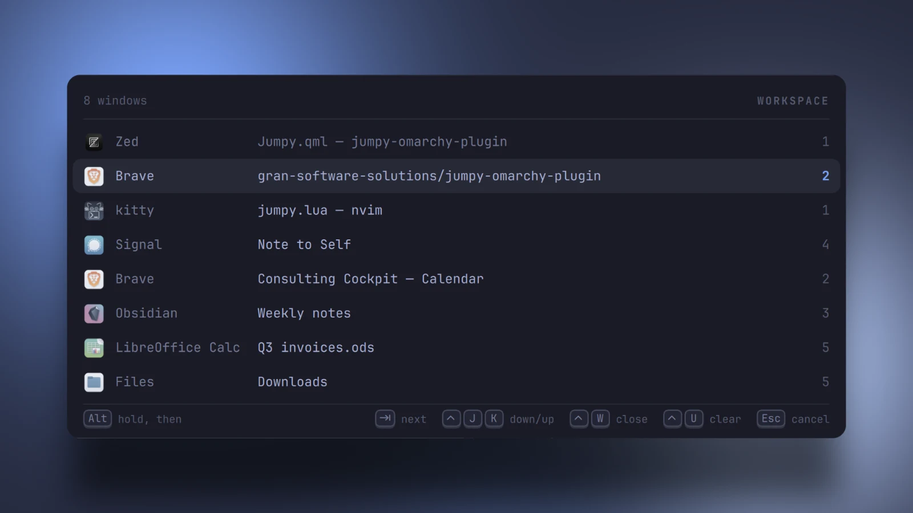

<div align="center">

# Jumpy

**Alt+Tab for Omarchy, built for speed.**
Tap to flip back. Hold to see every window. Type to find one.

`de.gransoftware.jumpy`&nbsp;&nbsp;·&nbsp;&nbsp;&nbsp;&nbsp;

<br>



<sub>Follows the active Omarchy theme and font — Tokyo Night and Snow here.</sub>

</div>

<br>

## Install

```bash
omarchy plugin add https://github.com/gran-software-solutions/jumpy-omarchy-plugin.git --enable --yes
```

Add one line to `~/.config/hypr/bindings.lua`, then run `hyprctl reload`:

```lua
dofile(os.getenv("HOME") .. "/.config/omarchy/plugins/de.gransoftware.jumpy/jumpy.lua")
```

It takes over Omarchy's `Alt+Tab`. The plugin never touches your configuration
itself, so that line is yours to add, and removing it brings the default back.
Requires Hyprland 0.56+ with a Lua config.

### Update and remove

```bash
omarchy plugin update de.gransoftware.jumpy
omarchy plugin remove de.gransoftware.jumpy
```

After removing, delete the `dofile` line and run `hyprctl reload`.

## Keys

Hold `Alt` throughout. Releasing it switches.

| | |
| --- | --- |
| `Tab` · `Shift+Tab` | Next · previous |
| letters | Fuzzy filter: `br` → Brave, `vsc` → Visual Studio Code |
| `Ctrl+J` · `Ctrl+K` | Down · up |
| `Ctrl+W` | Close the selected window |
| `Ctrl+U` · `Backspace` | Clear the filter · delete a letter |
| `` ` `` | Only this app's windows |
| `Esc` | Cancel |

A quick tap flips to your last window without drawing anything.

<details>
<summary><b>How it works</b></summary>
<br>

`jumpy.lua` runs inside Hyprland and owns the keys, the window snapshot, the
filter and the cursor. `Jumpy.qml` runs inside `omarchy-shell` and only draws,
driven by `omarchy-shell jumpy show|hide`.

While the list is up, a `jumpy` submap swallows every other key, so nothing
leaks into the window behind it. Three things end the submap: the Alt release,
a poll that notices Alt is up, and a 20-second timeout, so it can never trap
the keyboard.

</details>

## Vibe-coded

Every line of this plugin was written by [Claude](https://claude.com/claude-code)
from conversational prompts. It runs unsandboxed inside Hyprland and
`omarchy-shell`, so read the source before you enable it.

## License

[MIT](LICENSE) © Gran Software Solutions

App icons in the screenshots come from the apps themselves and remain
trademarks of their owners.
